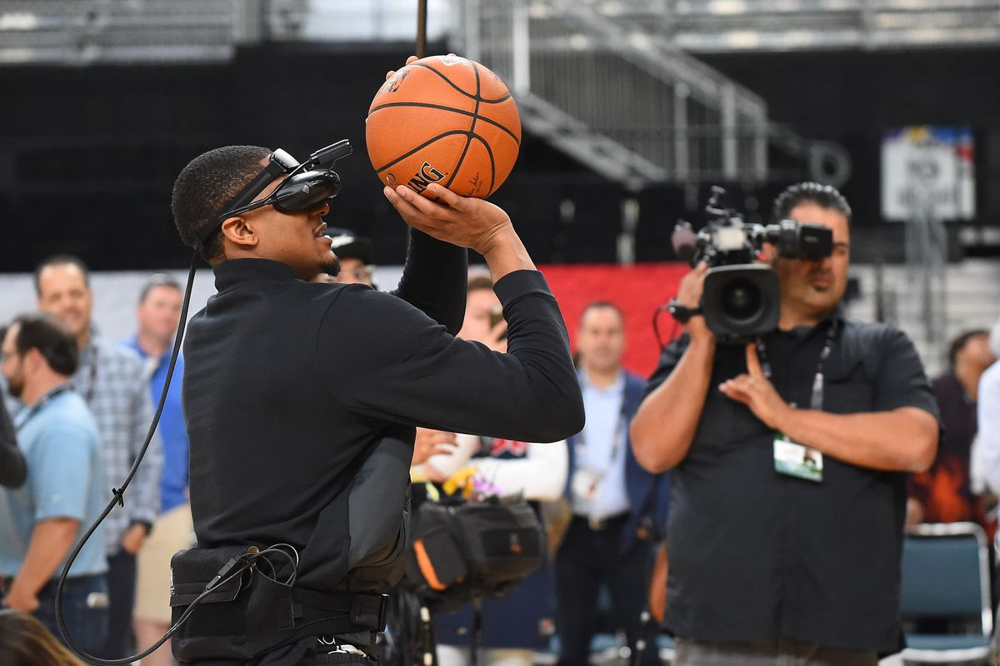

## Welcome to GitHub Pages

You can use the [editor on GitHub](https://github.com/vrscout/doc-synthese/edit/master/README.md) to maintain and preview the content for your website in Markdown files.

Whenever you commit to this repository, GitHub Pages will run [Jekyll](https://jekyllrb.com/) to rebuild the pages in your site, from the content in your Markdown files.

### Markdown

Markdown is a lightweight and easy-to-use syntax for styling your writing. It includes conventions for

```markdown
Syntax highlighted code block

# Header 1
## Header 2
### Header 3

- Bulleted
- List

1. Numbered
2. List

**Bold** and _Italic_ and `Code` text

[Link](url) and 
```

For more details see [GitHub Flavored Markdown](https://guides.github.com/features/mastering-markdown/).

### Jekyll Themes

Your Pages site will use the layout and styles from the Jekyll theme you have selected in your [repository settings](https://github.com/vrscout/doc-synthese/settings). The name of this theme is saved in the Jekyll `_config.yml` configuration file.

### Support or Contact

Having trouble with Pages? Check out our [documentation](https://help.github.com/categories/github-pages-basics/) or [contact support](https://github.com/contact) and we’ll help you sort it out.

# La réalité virtuelle pour le grand public sera-t-elle limitée aux jeux ?

## Introduction

### Qu'est-ce que la réalité virtuelle ?

La réalité virtuelle (RV) est un environnement généré par la technologie informatique qui crée chez l'utilisateur la sensation d'être immergé dans une expérience simulée qui peut être similaire ou complètement différente du monde réel.  Depuis sa conception par la marine américaine pendant la seconde guerre mondiale (simulateurs de vol), cette technologie a été progressivement développée tout au long des 20ème et 21ème siècles, et pendant cette période, différents systèmes de réalité virtuelle ont été créés. 

Les systèmes de réalité virtuelle typiques se composent principalement d'un casque stéréoscopique qui fournit à l'utilisateur l'environnement virtuel visuel et auditif, et de contrôleurs qui permettent à l'utilisateur d'interagir avec des objets dans l'environnement virtuel. Sur cette diapositive, nous pouvons voir un ensemble de réalité virtuelle typique, un HTC Vive, et un utilisateur qui l'utilise.

 

### Le contexte historique

L'origine de la réalité virtuelle remonte à la Seconde Guerre mondiale. La marine américaine a contacté le MIT pour la création éventuelle d'un simulateur de vol adapté à la formation des pilotes de bombardiers, un projet appelé Whirlwind (1951). Cependant, le premier système de réalité virtuelle similaire à celui que nous connaissons aujourd'hui a été conçu par Morton Heilig en 1962, suivi par The Sword of Damocles d'Ivan Sutherland en 1968. Pendant 20 ans, entre 1970 et 1990, cette technologie et son développement ont été principalement utilisés dans les domaines de la médecine, des simulateurs de vol, de l'automobile et de la formation militaire. Ce n'est que dans les années 1990 que la technologie a commencé à être développée dans un but commercial, avec des lancements notables comme les consoles Sega VR (1991) et Virtual Boy de Nintendo (1995). Entre 2000 et 2010, l'accent sur le développement de la réalité virtuelle a été perdu. La décennie 2010 a été celle où la plupart des investissements ont été réalisés dans le développement de la technologie d'un point de vue commercial, avec le lancement de dispositifs tels que Oculus Rift (2010), HTC Vive (2015), PlayStation VR (2014).

 

## Applications en dehors du contexte des jeux

_A lot of people have no idea that it’s been used (VR) for things other than games and entertainment._ - [Thong Nguyen, TEDxMinneapolis 2018](https://youtu.be/eFHj8OVC1_s)

Sans aucun doute, l'application la plus connue de la réalité virtuelle est celle liée aux jeux vidéo. Cependant, l'éventail des utilisations potentielles de cette technologie est beaucoup plus large, et elle peut être appliquée à des domaines tels que l'art, les sports, la formation, la thérapie… 

### L'art immersif

Le caractère fortement immersif de la réalité virtuelle offre un potentiel intéressant pour la création artistique et l'observation. D'un point de vue créatif, l'environnement virtuel facilite grandement la production de peintures tridimensionnelles, par le biais de la "sculpture". La possibilité d'avoir n'importe quel point de vue, ainsi que la possibilité d'interagir avec l'œuvre en question, sont des caractéristiques très attrayantes pour les artistes. Dans le GIF ci-dessus, on peut voir une artiste connue pour ses œuvres créées en réalité virtuelle. Elle utilise des applications de modélisation 3D spécialement conçues à cet effet, comme Tilt Brush ou Google Blocks. La réalité virtuelle offre également un grand potentiel pour la création de productions audiovisuelles, telles que des animations et des films. Dans le GIF ci-dessous, nous pouvons voir un peu du "making of" de ["The Remedy"](https://www.roadtovr.com/making-the-remedy-quill-daniel-martin-peixe/?platform=hootsuite), un court-métrage d'animation réalisé avec le logiciel d'animation Oculus Quill. En ce sens, le spectateur pourra non seulement observer l'œuvre, mais aussi la vivre. Afin de promouvoir l'art dans la réalité virtuelle, certaines galeries ont été créées : The Festival of the Impossible, Acute Art.

<a href="https://youtu.be/mURBMcL_yJk"> </a> <a href="https://youtu.be/ahb4OmBz7QQ"> </a>
  
### Les sports
  
Un autre domaine où la réalité virtuelle est déjà utilisée est celui de l'entraînement sportif. Le fait de disposer d'un environnement virtuel réaliste donne à l'athlète la possibilité de s'entraîner de manière répétée dans des situations importantes au sein du sport. Plus précisément, il permettrait aux athlètes de s'entraîner à l'aspect technique, comme par exemple en ski, où un simulateur offre la possibilité de pratiquer certains circuits pendant toute l’année ; à l'aspect tactique, en recréant des situations où la stratégie joue un rôle important, comme au football ou au basket-ball ; et à l'aspect psychologique, en permettant l’amélioration de la prise de décisions, la connaissance et la force mentale. Les grandes ligues sportives telles que la NFL et la NBA incluent déjà la réalité virtuelle dans leurs plans d'entraînement. Pour plus d'informations, consultez les liens suivants ([Lien 1](https://hedgehoglab.com/blog/vr-sport-training), [Lien 2](https://www.viar360.com/5-sports-benefiting-virtual-reality/)).
  
 

### La formation

C'est dans le domaine de la formation que la technologie s'est le [plus développée](https://builtin.com/edtech/virtual-reality-in-education), à l'exception des jeux vidéo. Grâce aux expériences immersives et interactives proposées par les simulateurs, certaines compétences peuvent être acquises indépendamment de la distance qui sépare l'élève de son environnement ou des erreurs qu'il commet, notamment dans les tâches à haute responsabilité. Ainsi, l'enseignement à distance est beaucoup plus efficace. En particulier, grâce à l'utilisation de programmes tels que rumii, Discovery Education, OSSO VR et Airbus VR Flight Trainer, il est possible de générer des environnements virtuels dans lesquels sont simulés [des laboratoires](https://www.labster.com/), [des visites sur le terrain](https://www.ncbi.nlm.nih.gov/pmc/articles/PMC6284182/#B60), [des opérations chirurgicales](https://time.com/collection/best-inventions-2019/5733053/osso-vr/) et [le pilotage d'avions](https://services.airbus.com/en/newsroom/stories/2019/12/airbus-brings-cockpit-to-you-with-new-virtual-reality-flight-trainer.html).
